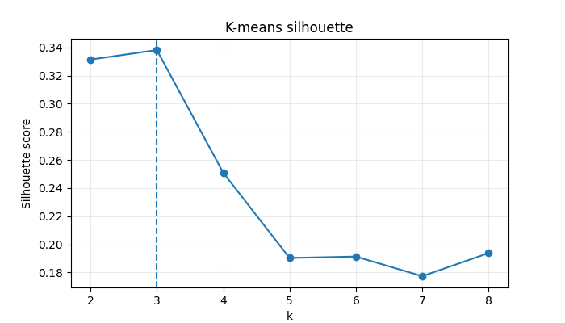

Zadanie projektu bolo: „Pokúste sa čo najlepšie modelovať výsledky parlamentných volieb v jednotlivých okresoch SR v závislosti od rôznych charakteristík týchto okresov (nezamestnanosť, priemerný plat, vekové zloženie...). Výsledné modely by mali byť interpretovateľné, čiže z modelu by sa mal dať vyčítať pozorovaný vzťah medzi charakteristikami okresov a výsledkami volieb.“

Cieľom tohto projektu je analyzovať a modelovať výsledky parlamentných volieb v jednotlivých okresoch Slovenskej republiky v závislosti od rôznych socioekonomických a demografických charakteristík týchto okresov, ako sú nezamestnanosť, priemerný plat, vekové zloženie obyvateľstva alebo ekonomická aktivita. Dôraz je kladený na použitie interpretovateľných modelov, z ktorých je možné priamo vyčítať vzťahy medzi vstupnými premennými a volebnými výsledkami.

## Part 1 - Zber dát a vytvorení databázy 

### Použité zdroje dát
- Štatistický úrad SR – DataCube 
- https://datacube.statistics.sk
- Štatistický úrad SR – voľby 
- https://volby.statistics.sk
- Sčítanie obyvateľov – Štruktúra obyvateľstva podľa odvetvia ekonomickej činnosti
- https://www.scitanie.sk
- ÚPSVaR – mesačné štatistiky nezamestnanosti 
- https://www.upsvr.gov.sk

### Prehľad vstupných súborov a dátových vrstiev
Dáta boli spracované z viacerých Excel/CSV súborov, ktoré reprezentovali tematické vrstvy. Najdôležitejšie vrstvy pre neskoršie modelovanie na úrovni okresov boli:
-	Volebné výsledky a účasť: počet hlasov, podiel hlasov, účasť, počet okrskov a pod.
-	Ekonomické a demografické charakteristiky území: pohlavie, vekové skupiny, vzdelanie, aktivita atď.
-	Nezamestnanosť : počet uchádzačov, miera evidovanej nezamestnanosti (%)
-	Priemerná mzda : priemerná mzda/indikátor podľa územnej jednotky

### Metodika spracovania dát
Príprava dát bola realizovaná pomocou Python skriptov:

1. **Načítanie dát**  
   Všetky relevantné súbory boli načítané z jedného priečinka.

2. **Čistenie dát**  
   Odstránenie prázdnych stĺpcov, technických stĺpcov typu `Unnamed`, normalizácia textu.

3. **Deduplikácia**
   - záznamy s rovnakým kódom boli zlúčené do jedného riadku,
   - pre každý stĺpec bola použitá prvá nenulová hodnota.

4. **Integrácia dát**
   - volebných údajov s demografickými a ekonomickými dátami,
   - doplnenie ukazovateľov nezamestnanosti a priemernej mzdy.

5. **Kontrola kvality**
   - výpočet match-rate pre obce a okresy,
   - identifikácia nezlúčených jednotiek.

### Výsledky prípravy dát
- Obce: match-rate ≈ 99,97 %  
- Okresy: match-rate ≈ 98,8 %  

Nezlúčené záznamy predstavujú najmä kategóriu Zahraniči, ktorá nemá ekvivalent v demografických dátach.

### Výstup
Výsledkom je SQLite databáza, ktorá obsahuje viacero tabuliek (volebných, demografických a ekonomických). 

Táto databáza tvorí základ pre ďalšie fázy projektu, ktorou je samotné modelovanie a interpretácia volebných výsledkov.

## Part 2 — Results model (predikcia podielu hlasov vo voľbách)

### Cieľ analýzy
V tejto časti sa zameriavame na analýzu faktorov, ktoré ovplyvňujú podiel
hlasov v parlamentných voľbách na úrovni okresov Slovenskej republiky.
Aj keď hlavnou úlohou je pochopenie vzťahov medzi parametrami okresov a
hlasovaním v tých okresoch, výsledný model by ešte mal fungovať dobre sám osebe
(čiže mal by dobre predikovať hlasy pre politické subjekty na základe
parametrov okresu).

---

### Premenné

**Závisle premenné**
- podiely hlasov pre politické strany a koalície.

**Vysvetľujúce premenné**
- demografia: podiel a počet mužov a žien, podiel a počet obyvateľov, ktoré
  patria rôznym vekovým skupinám (do 15 rokov, 15-64 rokov, 65 a viac rokov),
  podiel a počet obyvateľov so slovenským občianstvom, obyvateľov narodených na
  Slovensku, obyvateľov-Slovákov a cudzincov,
- urbanizácia: podiel a počet žijúcich v meste a na vidieku,
- vzdelanie: podiel a počet ľudí s rôznym najvyšším dosiahnutým vzdelaním,
- trh práce: nezamestnanosť, rôzne pracovné stavy (pracujúci, študent vysokej
  školy, nezamestnaný atď.), rôzne pracovné vzťahy (zamestnanec, podnikateľ),
- ekonomika: priemerná mzda.

---

### Metódy

Na predikciu podielov hlasov vo voľbách bola použitá **multinomická logistická
regresia**, konkrétne `sklearn.linear_model.LogisticRegression`. Jej výhodou je
to, že ona funguje ako pravdepodobnostný model, čiže na rozdiel od lineárnej
regresie nepotrebujeme zvlášť aplikovať softmax na výsledok - to nebude fungovať
dobre, pretože lineárna regresia (LASSO, RIDGE) bude sa optimalizovať podľa
svojich predpisov a naše ohraničenie na to, aby sa všetko skladalo do 1, bude
ju iba miasť.

Aby naša úloha patrila do množiny úloh, ktoré vie riešiť logistická regresia,
vieme ju preformulovať na _"aké sú pravdepodobnosti hlasovania za jednotlivé
politické strany za predpokladu parametrov okresu voliča?"_

Pre hodnotenie, ci dobre alebo zle model predikuje podiely, bol použitý
**log loss**, pretože je to základná chybová funkcia pre logistickú regresiu
a ona lepšie zohľadňuje logaritmicky background metódy než MSE alebo MAE.

Pre férové rozhodovanie dôležitosti parametra pre model vstupne dáta sú
štandardizované pomocou `sklearn.preprocessing.StandardScaler`. Vplyv parametra
na podiel hlasov za politickú stranu bol definovaný ako priemer absolútnych
hodnôt koeficientov logistickej regresie zodpovedajúcich tomuto parametru.

---

### Výsledky

**Kvalita modelu**

Multinomická logistická regresia sa prejavila veľmi dobre pre túto úlohu - pre
testový okres Bratislava IV model, ktorý nebol trénovaný na tom okrese, mal
log-loss 2.247, pričom ideálny log-loss je 2.243. Hľadanie parametrov, ktoré
majú najväčší vplyv na model, tiež nevyzerá zle, pretože model, ktorý nebol
trénovaný na testovom okrese, ale pritom bol trénovaný iba na 10 nájdených
dôležitých parametroch, dáva log-loss 2.269.

**Najdôležitejšie atribúty pre model**

10 atribútov okresov, ktoré majú najväčší vplyv na podiel hlasov pre model, sú nasledovne:

| Atribút                                                | Priemerný vplyv | Najpozitívnejší vplyv | Najnegatívnejší vplyv |
|:-------------------------------------------------------|:----------------|:----------------------|:----------------------|
| Podiel Slovákov                                        | 0.06            | 0.13 (KDH)            | -0.387 (MKÖ-MKS)      |
| Podiel študentov vysokých škôl                         | 0.031           | 0.18 (KDH)            | -0.17 (MKÖ-MKS)       |
| Podiel obyvateľov s iným pracovným stavom              | 0.028           | 0.178 (MKÖ-MKS)       | -0.061 (KDH)          |
| Podiel obyvateľov s iba základným vzdelaním            | 0.027           | 0.09 (MKÖ-MKS)        | -0.126 (SMER)         |
| Podiel obyvateľov s nezistenou štátnou príslušnosťou   | 0.024           | 0.054 (SME RODINA)    | -0.183 (MKÖ-MKS)      |
| Podiel obyvateľov v produktívnom veku                  | 0.024           | 0.143 (MKÖ-MKS)	     | -0.048 (KDH)          |
| Podiel osôb v domácnosti                               | 0.022           | 0.134 (MKÖ-MKS)	     | -0.034 (PS-SPOLU)     |
| Podiel obyvateľov s iba stredným vzdelaním s maturitou | 0.021           | 0.044 (VLASŤ)	       | -0.131 (MKÖ-MKS)      |
| Počet obyvateľov s iným pracovným stavom               | 0.021           | 0.106 (MOST-HÍD)      | -0.052 (ĽSNS)         |
| Podiel obyvateľov s nezisteným pracovným stavom        | 0.02            | 0.136 (MKÖ-MKS)	     | -0.048 (SNS)          |

Aj keď vplyv niektorých parametroch na hlasovanie je zrejmý (napríklad to, že
zmena koncentrácie Slovákov ma vplyv na podporu strán s národnostnou politikou),
pre väčšinu dôležitých pre model atribútov sa nedá povedať, aký presne je vzťah
medzi týmto parametrom a hlasovaním za jednotlivé politické subjekty:
- Pre niektoré vzťahy sa da síce vysvetliť logiku, ale to vyzerá pritiahnuté za
  vlasy. Napríklad pre ten výsledok, že zvýšenie poctu obyvateľov s nezistenou
  statnou príslušnosťou zvyšuje pravdepodobnosť hlasu za konzervatívnu a
  anti-imigračnú stranu SME RODINA. To síce môže súvisieť, ale ten koeficient
  je veľmi malý a pravdepodobne nie je dôležitým a samostatným faktorom pre
  hlasovanie za túto stranu;
- Niektoré vzťahy vyzerajú vybraté náhodne. Napríklad to, že zvýšenie podielu
  obyvateľov s nanajvýš základným vzdelaním pravdepodobne najviac zmenši podiel
  hlasov za SMER;
- Niektoré vzťahy vypadajú aj kontraintuitívne. Napríklad, že zvýšenie podielu
  študentov vysokých škôl v okrese ma obrovský vplyv na zvýšenie podielu hlasov
  za Kresťanskodemokratické hnutie; 
- Tiež medzi týmito parametrami chýbajú niektoré dôležite vzťahy, ktoré by sme
  očakávali, napríklad, nikde nevystupuje priemerná mzda, aj keď existuje názor,
  že regióny s vyšším platom sú viac liberálne, ale s nižším platom sú viac
  konzervatívne, čo by malo mat súvis s výberom strán a výsledkami volieb.

To sa da vysvetliť tým, že model pozerá iba na dáta a relatívne rozdiely medzi
okresmi a výsledkami volieb v nich, nie na reálnu logiku - model nevie kauzalitu.

Tiež si môžeme všimnúť, že pre všetky parametre okresov extrémne hodnoty vždy
majú etnické politické strany (Maďarská komunitná spolupatričnosť a MOST-HÍD).
To sa da vysvetliť tým, že tieto strany takmer nedostali hlasy z okresov, ktoré
nie sú na juhu Slovenska, kde je primárne lokalizovaná maďarská menšina.
Logistická regresia sa pre tieto strany naučila odlišovať južné okresy od
iných, preto veľmi ostro reaguje na zmenu koeficientov. 

**Najdôležitejšie atribúty pre politické strany**

Ak pozrieme na to, aké parametre najviac ovplyvňujú podiel hlasov za
jednotlivé politické strany v logistickej regresie, tiež si všimneme, že tie
dôležite atribúty väčšinou nezodpovedajú reálnej logike:

| Vybraté politické strany | Najdôležitejší koeficient a parameter       | 2. najdôležitejší koeficient a parameter          | 3. najdôležitejší koeficient a parameter          |
|:-----------------|:----------------------------------------------------|:--------------------------------------------------|:--------------------------------------------------|
| PS-SPOLU         | -0.05 (podiel študentov vysokých škôl)              | 0.047 (podiel pracujúcich dôchodcov)              | 0.041 (podiel príjemcov kapitálových príjmov)     |
| ĽSNS             | 0.116 (podiel Slovákov)                             | 0.091 (podiel obyvateľov narodených v SR)         | -0.052 (počet obyvateľov s iným pracovným stavom) |
| KDH              | 0.18 (podiel študentov vysokých škôl)               | 0.129 (podiel Slovákov)                           | 0.086 (podiel žiakov strednej školy)              |
| MOST-HÍD         | -0.311 (podiel Slovákov)                            | 0.133 (podiel obyvateľov s iným pracovným stavom) | 0.107 (podiel obyvateľov v produktívnom veku)      |
| MKÖ-MKS          | -0.387 (podiel Slovákov)                | -0.182 (podiel obyvateľov s nezistenou štátnou príslušnosťou) | 0.178 (podiel obyvateľov s iným pracovným stavom) |
| OĽANO a priatelia| 0.071 (podiel obyvateľov s iba základným vzdelaním) | -0.051 (podiel obyvateľov narodených v SR)        | 0.05 (počet obyvateľov s iným pracovným vzťahom)  |
| SMER             | -0.126 (podiel obyvateľov s iba základným vzdelaním)| 0.087 (podiel Slovákov)                           | 0.061 (počet Slovákov)                            |
| SaS              | -0.046 (podiel obyvateľov s iba stredným vzdelaním bez maturity) | 0.04 (podiel osôb na rodičovskej dovolenke) | 0.038 (podiel osôb na materskej dovolenke) |

Opäť existujú také vzťahy medzi parametrami a voľbou strán, ktoré dá sa pochopiť,
napríklad, podiel a počet Slovákov a nacionalistické politické strany, pričom
aj pro-slovenské (ĽSNS), aj pro-menšinské (MKÖ-MKS a MOST-HÍD). Ale vo väčšine
prípadov vyber parametrov modelom sa nedá vysvetliť. Je možno neuveriteľné, že
podiel študentov vysokých škôl, čo vždy bola najliberálnejšia a najopozičnejšia
skupina, negatívne ovplyvňuje podiel hlasov za Progresívne Slovensko, ale
podiel pracujúcich dôchodcov, čo sú často konzervatívni občania, ma vplyv
pozitívny. Je možno provokatívne, že sa podiel hlasov za opozičnú stranu OĽANO
relatívne zväčši, ak sa zväčši podiel nevzdelaných občanov, hoci podiel hlasov
za konzervatívnu a proti-európsku stranu SMER pritom zmenši.

Zrejme to nič nehovorí o kauzalite. Model bol trénovaný na relatívne malom pocte
dát, čiže neznamená, že perfektne reflektuje realitu, aj keď dáva dobre výsledky.
Tiež je dobre spomenúť, že atribúty sú často veľmi korelované a niekedy sú aj
závislé, preto model môže rozhodnúť zvážiť nejaký parameter viac ako iný, aj keď
v reálnom živote ten iný môže byt viac dôležitý.

Takže nie je dobre na základe tohoto výsledku hovoriť o reálnych súvisoch
politických strán a parametrov. Tiež si dobre uvedomovať, že koeficienty majú
rôznu hodnotu, a -0.05 pri podiele študentov pre Progresívne Slovensko
pravdepodobne ma oveľa menší vplyv ako -0.387 pri podiele Slovákov pre MKÖ-MKS.

**Vplyv na podiel hlasov**

Priama analýza toho, ako zmena parametra na vstupe mení predikciu modelu, je
komplikovaná:
- kvôli štandardizácie trenovácie aj vstupne dáta menia svoj tvar, čo ma vplyv
  na koeficienty,
- na rozdiel od lineárnej regresie, kde lineárna zmena koeficienta dáva
  lineárnu zmenu výsledku, v našom modeli závislosť nie je lineárna
- aby previesť logity na pravdepodobnosti, model používa softmax, čo znamená,
  že zmena jedného parametra bude mat vplyv na cely vektor odpovede, pretože sa
  mení súčet v menovateli.

Preto bolo rozhodnuté pozrieť na vplyv takým spôsobom, že pre testový vstup
zmeníme niekoľko parametrov a potom pozrieme, ako sa pri tom zmení predikcia nášho
modelu. Ako kandidáti na zmenu boli vybraté podiel Slovákov v okrese a podiel
študentov vysokých škôl v okrese, pretože tieto atribúty majú najväčší vplyv na
cely model a veľký vplyv na predikcie pre jednotlivé politické strany.

Teda po zmene parametrov sme dostali:

| Politické strany | Nezmenené | Dvakrát viac podiel študentov | Dvakrát menej podiel študentov | Dvakrát viac podiel Slovákov | Dvakrát menej podiel Slovákov |
|:-----------------|----------:|------------------------------:|-------------------------------:|-----------------------------:|------------------------------:|
| PS-SPOLU         |     0.145 |                         0.099 |                          0.170 |                        0.112 |                         0.159 |
| ĽSNS             |     0.047 |                         0.034 |                          0.054 |                        0.072 |                         0.037 |
| KDH              |     0.057 |                         0.137 |                          0.036 |                        0.093 |                         0.043 |
| MOST-HÍD         |     0.005 |                         0.003 |                          0.006 |                        0.000 |                         0.014 |
| MKÖ-MKS          |     0.003 |                         0.001 |                          0.004 |                        0.000 |                         0.010 |
| OĽANO a priatelia|     0.253 |                         0.262 |                          0.241 |                        0.229 |                         0.257 |
| SMER             |     0.122 |                         0.120 |                          0.119 |                        0.155 |                         0.105 |
| SaS              |     0.123 |                         0.102 |                          0.131 |                        0.109 |                         0.126 |
| iné              |     0.245 |                         0.242 |                          0.239 |                        0.230 |                         0.249 |

Zvyšovanie podielu študentov najviac vplýva pozitívne na KDH - po dvojnásobnom
zväčšení podielu študentov predikcia podielu hlasov za KDH je o takmer 2.5 krát
väčšia, pričom po dvojnásobnom zmenšení je predikcia len o 1.5 krát menšia.

Najhoršie to vplýva na strany s národnostnou politikou: ak podobne zväčšime
podiel študentov vysokých škôl, tak predpovedaný podiel hlasov za MOST-HÍD sa
zmenši o 1.7 krát, ale podiel hlasov za Maďarsku komunitnú spolupatričnosť
klesne skoro trojnásobne. Ak o dva krát zmenšime podiel študentov, podiel
hlasov za MOST-HÍD sa zväčši iba o 1.25 a podiel za MKÖ-MKS iba o 1.6.

Zaujímavé je Progresívne Slovensko, lebo dvojnásobne zväčšenie podielu
študentov mení výsledok volieb tak, že podiel hlasov za nich 1.5-krat menší.
Ako už bolo spomínané, toto je prekvapivé správanie, keďže študenti sú často
liberálne a opozičné.

Pri zmene podielu Slovákov etnické politické strany pociťujú veľmi negatívny
vplyv. Ak podiel Slovákov v okrese bude len dvakrát väčší, podiel hlasov za
MOST-HÍD klesne o 9.5 krát a podiel hlasov za MKÖ-MKS klesne pätnásťnásobne,
pričom ak sa nastane opačná situácia, podiel hlasov sa stupne trojnásobne pre
MOST-HÍD a takmer štvornásobne pre Maďarsku komunitnú spolupatričnosť.

Tiež je zrejme a očakávateľné, že po zväčšení podielu Slovákov v okrese sa zväčši
podiel hlasov za konzervatívne strany: Kotlebovci dostanú o 1.5 krát viac hlasov,
KDH o 1.6, SMER o 1.26. Dôležite si pritom uvedomiť, že po zmenšení koncentrácie
Slovákov podiel hlasov za tie strany neklesne prudko - o okolo 1.3 krát pre ĽSNS
a Hnutie a 1.16 pre SMER.

Tiež si môžeme všimnúť, že ostatne politické strany pri týchto zmenách
zachovávajú takmer ten istý podiel hlasov, čiže pre ne tieto atribúty v modeli
nie sú veľmi dôležite (čo potvrdzuje časť o najdôležitejších atribútoch pre
jednotlivé strany).

Ešte je vidieť, že po veľkej zmene podielu hlasov za nejakú stranu často trochu
mení podiel hlasov za iné strany, aj keď ten parameter nesúvisí s tými stranami.
Je to logické - ak nejaká strana stratí podporu, tak bývalé priaznivci budú
podporovať iné strany, a naopak. To ukazuje, že predpovede aj nejaké koeficienty
môžu byt ovplyvnene "doplnkovým" efektom, čiže ich zmena je vedľajším účinkom
iných zmien v modeli.

---

### Zhrnutie

- V tejto časti projektu bol urobený model, ktorý predikuje podiely hlasov
  politických strán v okrese na základe socio-demografických a ekonomických
  parametrov toho okresu.
- Ako model bola zvolená multinomická logistická regresia, ktorá sa ukázala ako
  vhodná pre túto úlohu a dobre predikovala výsledok volieb v okrese.
- Napriek komplikovaným vzťahom vstupných dát a koeficientov modelu, sa podarilo
  nájsť parametre okresov, ktoré majú najväčší vplyv na výsledok volieb a
  potvrdiť ich význam a dôležitosť pre predikovanie. Hlavnými atribútmi sa
  prejavili podiel Slovákov v okrese a podiel študentov vysokých škôl v okrese.
- Nájdené parametre boli často zle interpretovateľné kvôli korelácie a závislosti
  premenných a tomu faktu, že model pozeral iba na dáta, nie na reálnu sociálnu
  logiku. Preto nie je dobre používať takýto nastroj na hľadanie kauzality a
  vzťahov v reálnom svete, aj keď on ma vysokú presnosť predikcie.

---

## Part 3 — Turnout model (Volebná účasť)

### Cieľ analýzy
V tejto časti  sa zameriavame na analýzu faktorov, ktoré ovplyvňujú
volebnú účasť v parlamentných voľbách na úrovni okresov Slovenskej republiky.
Cieľom nie je presná predikcia, ale pochopenie základných vzťahov medzi
charakteristikami okresov a volebnou účasťou.

---

### Premenné

**Závislá premenná**
- `turnout` – volebná účasť v percentách

**Vysvetľujúce premenné**
- demografické: podiel obyvateľov vo veku 0–14 rokov, 65+ rokov a podiel žien,
- trh práce: miera nezamestnanosti (vrátane kvadratického člena),
- urbanizácia a veľkosť okresu: podiel mestského obyvateľstva a logaritmus populácie,
- vzdelanie: podiel vysokoškolsky vzdelaných osôb a osôb bez vzdelania,
- ekonomika: priemerná mzda,
- sociálna štruktúra: podiel cudzincov.

Niektoré skupiny premenných (napr. vzdelanie alebo
vek) sú v dátach vyjadrené prostredníctvom podielov,
ktoré v súčte tvoria 100 %. Zahrnutie všetkých kategórií
by viedlo k perfektnej multikolinearite a
neidentifikovateľnosti modelu. Z tohto dôvodu sme
zvolili iba vybrané reprezentatívne kategórie a ostatné
ponechali ako referenčné.

Podobne pri vekovej štruktúre sme uprednostnili použitie
podielu najmladšej a najstaršej populácie, ktoré lepšie
zachytávajú demografické extrémy, zatiaľ čo stredná
produktívna veková skupina slúži implicitne ako
referenčná kategória.

Kvadratický člen nezamestnanosti bol zahrnutý na testovanie
možnej nelinearity vzťahu medzi nezamestnanosťou a volebnou
účasťou. Vplyv sa však ukázal ako prevažne lineárny.

---

### Metódy
Ako hlavný nástroj bola použitá **lineárna regresia (OLS)**, ktorá umožňuje
jednoduchú interpretáciu výsledkov.
Keďže medzi premennými existuje silná korelácia, bola vypočítaná aj
VIF štatistika.

Na výber najdôležitejších premenných bola použitá **LASSO regresia**.
Na základe jej výsledkov sme odhadli aj zjednodušený (restricted) OLS model.
Ako doplnková kontrola bol použitý **Random Forest**, ktorý slúžil len na
porovnanie dôležitosti premenných.

---

### Výsledky
Plný OLS model dosahuje hodnotu \(R^2 = 0,82\) (upravené \(R^2 = 0,78\)),
čo znamená, že vysvetľuje veľkú časť rozdielov vo volebnej účasti medzi okresmi.
Model je ako celok štatisticky významný (F-test, \(p < 0,001\)).

**Tabuľka 1: Faktory ovplyvňujúce volebnú účasť – zjednodušený OLS model**

| Premenná | Koeficient | Std. chyba | p-hodnota |
|---------|-----------:|-----------:|----------:|
| Podiel mestského obyvateľstva (urban) | -0.169 | 0.029 | <0.001 |
| Nezamestnanosť (unemployment) | -1.296 | 0.522 | 0.015 |
| Nezamestnanosť² (unemployment_sq) | 0.032 | 0.024 | 0.189 |
| Vysokoškolské vzdelanie (edu_uni) | +0.685 | 0.135 | <0.001 |
| Bez vzdelania (edu_none) | -10.113 | 4.753 | 0.037 |
| Priemerná mzda (avg_wage) | +0.004 | 0.004 | 0.292 |
| Podiel cudzincov (foreigners) | -1.506 | 0.633 | 0.020 |
| **Konštanta** | **68.878** | **4.994** | **<0.001** |
|  |  |  |  |
| **R² / Adj. R²** | **0.757 / 0.733** |  |  |
| **Počet okresov** | **79** |  |  |

**Tabuľka 2: Porovnanie modelov pre volebnú účasť**

| Model | R² | Adj. R² |
|------|----:|--------:|
| Full OLS | 0.820 | 0.784 |
| Restricted OLS | 0.757 | 0.733 |
| Random Forest (in-sample) | 0.949 | – |

**Tabuľka 3: Dôležitosť premenných podľa modelu Random Forest**

| Premenná | Dôležitosť |
|---------|-----------:|
| Bez vzdelania (edu_none) | 0.238 |
| Nezamestnanosť (unemployment) | 0.182 |
| Nezamestnanosť² (unemployment_sq) | 0.166 |
| Podiel cudzincov (foreigners) | 0.084 |
| Vysokoškolské vzdelanie (edu_uni) | 0.067 |
| Pracujúci dôchodcovia | 0.063 |
| Podiel detí (0–14 rokov) | 0.062 |
| Urbanizácia | 0.029 |
| Priemerná mzda | 0.029 |
| Podiel žien | 0.027 |
| Podiel pracujúcich | 0.021 |
| Log(populácie) | 0.016 |
| Podiel 65+ | 0.016 |

Z výsledkov vyplýva niekoľko hlavných zistení:

- **Vzdelanie má silný vzťah k volebnej účasti.**  
  Podiel vysokoškolsky vzdelaných obyvateľov (`edu_uni`) má
  pozitívny a štatisticky významný vplyv na účasť
  (koeficient približne \(+0,685\), \(p < 0,001\)).
  Naopak, podiel osôb bez vzdelania (`edu_none`) má výrazný
  negatívny vplyv (koeficient približne \(-10,13\), \(p ~ 0,02\)).
  Aj keď ide o malý podiel populácie, táto premenná pravdepodobne
  zachytáva mieru sociálnej marginalizácie v okrese.

- **Nezamestnanosť** je spojená s nižšou volebnou účasťou.
  Lineárny efekt miery nezamestnanosti je negatívny a štatisticky významný
  (koeficient približne \(-1,3\), \(p ~ 0,01\)).
  Kvadratický člen (`unemployment_sq`) má pozitívny, ale štatisticky
  nevýznamný koeficient, čo naznačuje, že vzťah nemusí byť úplne lineárny.

- **Urbanizované okresy** vykazujú nižšiu volebnú účasť.
  Premenná `urban` má stabilne negatívny a vysoko významný efekt
  (koeficient približne \(-0,17\), \(p < 0,001\)).

- **Podiel cudzincov** v okrese je spojený s nižšou účasťou
  (koeficient približne \(-1,5\), \(p ~ 0,01\)).

- **Priemerná mzda** (`avg_wage`) nemá po zohľadnení ostatných premenných
  štatisticky významný samostatný vplyv na volebnú účasť
  (\(p > 0,2\)).

Diagnostika multikolinearity (VIF) ukazuje vysoké hodnoty pre viaceré
socio-demografické premenné, čo je pri tomto type dát očakávané.
Preto boli výsledky ďalej overené pomocou výberu premenných.

Zjednodušený (restricted) OLS model, ktorý obsahuje najstabilnejšie
premenné, dosahuje mierne nižšiu, ale stále vysokú vysvetľovaciu schopnosť
(\(R^2 = 0,757\)).
Zachováva pritom rovnaké základné vzťahy:
pozitívny vplyv vysokoškolského vzdelania a negatívny vplyv
nezamestnanosti, podielu osôb bez vzdelania, urbanizácie a podielu cudzincov.

Ako doplnková kontrola bol použitý model Random Forest.
Poradie dôležitosti premenných potvrdzuje výsledky lineárnych modelov:
najvýznamnejšie sú `edu_none`, `unemployment` (vrátane kvadratického člena),
`foreigners` a `edu_uni`.
To naznačuje, že hlavné závery nie sú závislé od jednej konkrétnej
modelovej špecifikácie.

---

### Poznámky
Medzi použitými premennými je prítomná silná multikolinearita, čo je pri
socio-demografických údajoch bežné.
Preto výsledky interpretujeme hlavne na základe ich stability naprieč
viacerými modelmi.

Zaujímavým výsledkom je silný negatívny efekt pre premennú „bez vzdelania“.
Aj keď ide o malý podiel populácie, pravdepodobne ide o ukazovateľ sociálnej
marginalizácie, ktorá súvisí s nižšou politickou participáciou.

Výsledky naznačujú, že volebná účasť v okresoch SR je ovplyvnená najmä
vzdelanostnou štruktúrou obyvateľstva a situáciou na trhu práce.
Ekonomické ukazovatele majú skôr doplnkový význam.

------------

## Part 4 — Clustering slovenských okresov podľa socio-ekonomických alebo demografických charakteristík (K-means)

### Cieľ analýzy

V tejto časti sme zisťovali, či sa okresy Slovenska dajú rozdeliť do zmyslupných skupín, zhlukov, iba na základe ich demografických alebo socio-ekonomických charakteristík. Potom sme tieto zhluky interpretovali pomocou dát z volieb, aby sme videli, či sa rozdiely vo vlastnostiach okresoch prenášajú aj do výsledkov volieb. 

Venovali sme sa výskumným otázkam:
- Existujú prirodzené zhluky okresov Slovenska na základe demografických a socio-ekonomických ukazovateľov?
- Aký je vhodný počet zhlukov pre metódu K-means pri týchto dátach?
- Ktoré premenné najviac odlišujú zhluky?
- Ako sa vytvorené zhluky líšia z hľadiska volebnej účasti a volebných preferencií?

-----------

### Premenné 

**Premenné použité na zhlukovanie**
- demografia: podiel obyvateľov vo veku 0-14 rokov; podiel obyvateľov vo veku 65+ rokov; podiel žien;
- trh práce: miera evidovanej nezamestnanosti; kvadratický člen miery nezamestnanosti; podiel zamestnancov; podiel pracujúcich dôchodcov;
- urbanizáicia a veľkosť okresu: podiel mestského obyvateľstva; logaritmus počtu obyvateľov okresu
- vzdelanie: podiel vysokoškolsky vzdelaných osôb; podiel osôb bez základného vzdelania;
- ekonomika a sociálna štruktúra: priemerná mzda; podiel cudzincov; 

_Premenné boli pred zhlukovanm štandardizované pomocou z-skóre, aby mali porovnateľnú mierku._

**Premenné použité iba na interpretáciu zhlukov**
- volebná účasť (turnout),
- podiely hlasov pre politické strany (podiel_hlasov_*).

_Tieto dáta neboli použité pri zhlukovaní, slúžili len na interpretáciu výsledných skupín._

----

### Metodika

Na zhlukovanie sme použili algoritmus **K-means** nad štandardizovanými dátami. Počet zhlukov sme vyberali skúšaním hodnôt k ∈ {2,...,8} a porovnaním dvoch kritérií: silhouette score  a elbow metódy (images/kmeans_elbow-png), ktorá je založená na hodnote inertia (SSE v rámci zhlukov). Po výbere k sme zhluky vizualizovali pomocou PCA do 2D priestoru (images/pca_cluster.png).

Ako jednoduchý “proxy” ukazovateľ dôležitosti znakov pre zhlukovanie sme spravili sekundárnu analýzu:

- spočítali sme priemery znakov po zhlukoch v z-skóre jednotkách,
- pre každý znak sme spočítali rozdiel max(μ) - min(μ) medzi zhlukmi,
- top rozdiely sme vypísali ako "Top znaky podľa rozdielu medzi zhlukmi"

Keďže vieme, že K-means nemá prirodzenú mieru významnosti premenných, použili sme podiel medzizhlukovej variability na celkovej variabilite (SSB/SST) ako proxy ukazovateľ.

---

### Výsledky
Algoritmus K-means identifikoval tri zhluky okresov Slovenskej republiky, ktoré obsahovali rôzny počet okresov:
0. zhluk: 48 okresov
1. zhluk: 8 okresov
2. zhluk: 23 okresov

Najmenší zhluk tvorili mestské okresy Bratislavy a Košíc, ktoré sa výrazne odlišujú od zvyšku Slovenska najmä vyššou mierou urbanizácie, vyššími príjmami a vyšším podielom vysokoškolsky vzdelaných obyvateľov. 

Zhluk 0. obsahuje väčšinu slovenských okresov a možno ich nazvať "priemernými" okresmi. Zhluk 2. zahŕňa okresy s vyššou mierou nezamestnanosti, nižšími mzdami a nižším podielom vysokoškolského vzdelania.

Kvalita zhlukovania bola vyhodnotená pomocou silhouette score, ktoré nadobudlo hodnotu 0,338, čo hovorí o stredne silnej separácii zhlukov. Algoritmus dosiahol konvergenciu už po 4 iteráciách, čo naznačuje stabilitu riešenia. Finálna hodnota inertia (SSE) = 513,0 potvrdzuje, že zvolený počet zhlukov predstavuje kompromis medzi jednoduchosťou a presnosťou.

Na vizualizáciu výsledkov bola použitá PCA analýza, pričom prvé dva hlavné komponenty vysvetľujú 64,48 % celkovej variability dát, čo umožňuje zhluky prehľadne interpretovať v 2D priestore. Pôvodné dáta mali totiž viac dimenzií.

Ako najdôležitejšie premenné pre tvorbu zhlukov sa ukázali:

- podiel vysokoškolsky vzdelaných obyvateľov,
- miera nezamestnanosti,
- urbanizácia,
- priemerná mzda,
- podiel osôb bez základného vzdelania.

Tieto premenné mali najvyšší podiel variability vysvetlenej rozdielmi medzi zhlukmi (SSB/SST).

---

### Interpretácia zhlukov pomocou volebných dát

Ku každému okresu sme dodatočne priradili reálne výsledky parlamentných volieb a údaje o volebnej účasti, aby sme mohli vytvorené zhluky interpretovať aj z politického hľadiska. Jednotlivé zhluky sa líšia nielen svojimi socio-ekonomickými charakteristikami, ale aj volebným správaním, čo naznačuje súvislosť medzi socio-ekonomickou štruktúrou okresov a politickými preferenciami obyvateľov.  

**Mestský zhluk** (Bratislava a Košice) mal najvyššiu volebnú účasť (70,1 %) a zároveň výrazne nižšiu podporu strán **SMER - sociálna demokracia (12,3 %)** a **Kotlebovci - Ľudová strana Naše Slovensko (4,5 %)**. Naopak, v tomto zhluku bola výrazne vyššia podpora strán ako **ZA ĽUDÍ (10,2 %)**. Tieto okresy sa vyznačovali vysokým podielom vysokoškolsky vzdelaných obyvateľov, vyššími príjmami a vysokou mierou urbanizácie. 

Tieto zistenia naznačujú, že vyššia úroveň vzdelania, vyšší príjem a mestské prostredie môžu súvisieť s nižšou podporou krajne pravicových politických strán a s vyššou podporou liberálnejších subjektov.

V **zhluku s vyššou mierou nezamestnanosti a nižšímmi mzdami** sme pozorovali najnižšiu volebnú účasť (59,5 %) a zároveň najvyššiu podporu strán **SMER - sociálna demokracia (21,8 %)**, **Kresťanskodemokratické hnutie (6,9 %)** a **Kotlebovci - Ľudová strana Naše Slovensko (9,9 %)**. Okresy sa vyznačovali aj nižšou úrovňou vzdelania a vyššou mierou socio-ekonomickej neistoty, čo sa odráža aj v štruktúre politických preferencií obyvateľstva. Výsledky naznačujú, že socio-ekonomická neistota a nižšia úroveň vzdelania môžu súvisieť s vyššou podporou sociálne orientovaných a protestných politických strán.

V **najväčšom zhluku okresov** sú politické preferencie vyváženejšie a podiely hlasov jednotlivých strán sú bližšie k celoslovenskému priemeru. Tento zhluk reprezentuje okresy so zmiešanými socio-ekonomickými charakteristikami, čo sa prejavuje aj v menej vyhranených volebných preferenciách.
